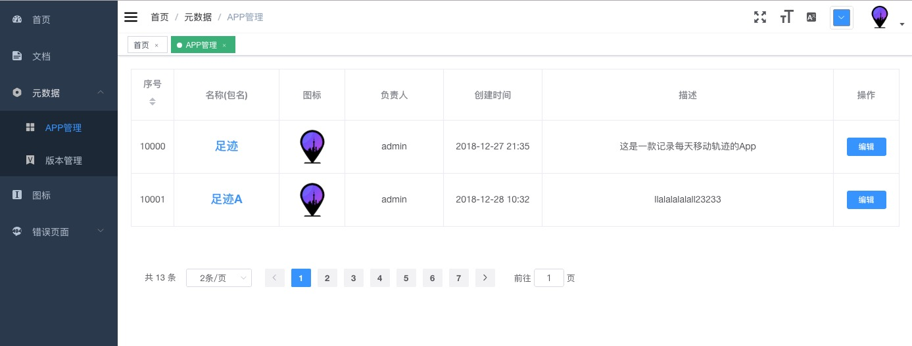

<p align="center">
  <a href="https://github.com/vuejs/vue">
    
  </a>
  <a href="https://github.com/ElemeFE/element">
    
  </a>
  <a href="https://travis-ci.org/PanJiaChen/vue-element-admin" rel="nofollow">
    
  </a>
</p>

## 简介
使用PanJiaChen的:[vue-element-admin](https://github.com/PanJiaChen/vue-element-admin/blob/master/README.zh-CN.md)搭好的基础框架


go: web_server （Backend）   
vue: web_client (Frontend)

- **go主要框架** 
``` 
  github.com/gin-gonic/gin
  github.com/dgrijalva/jwt-go
  github.com/flywithbug/log4go
  gopkg.in/mgo.v2
```
  
  
- **Vue主要框架**   
 ``` 
  vue-router
  vuex
  axios
  vue-i18n
  element-ui
 ```

``` bash
# govendor add  dependencies
go run main.go

# serve with hot reload at localhost:6201
open  http://localhost:6203 

cd web_client

# install dependencies
npm install

# serve with hot reload at localhost:8080
npm run dev

# build for production with minification
npm run build

# build for production and view the bundle analyzer report
npm run build --report
```

-------------------------------
## 功能说明 (vue & go)
- [x] 登录 / 注销

- [x] 权限验证
  - [x] 页面权限  

- [x] 全局功能
  - [x] 国际化多语言
  - [x] 动态侧边栏（支持多级路由嵌套）
  - [x] 快捷导航(标签页)
  - [x] ScreenFull全屏
  - [x] 自适应收缩侧边栏


- [x] 错误页面 
  - [x] 401 
  - [x] 404 

- [ ] 数据管理 
  - [x] App管理
  - [ ] 版本管理-doing

- [ ] 开发工具
  - [ ] 数据模型 
  - [ ] API管理
  
  
### 页面示例
   